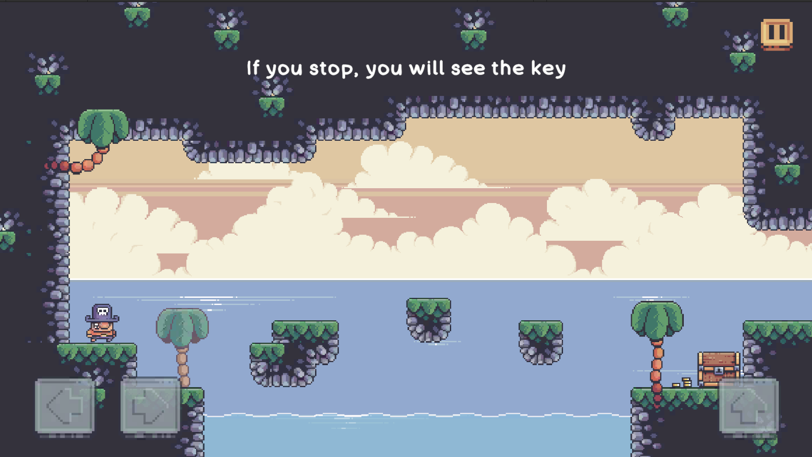

Tricky Pirate Island is a small puzzle game that I’ve passionately developed over the past time. This game is not just a personal project, but also a special tribute to my dear friend, HectorSuan. In the game, you’ll take on the role of Suẩn, embarking on a journey to conquer challenging and tricky puzzles on a mysterious pirate island. I hope that each puzzle will bring players moments of excitement, suspense, and unexpected joy. If you find the game engaging, don’t hesitate to give me a Star to show your support! Above all, I’d greatly appreciate your feedback and suggestions to help make Tricky Pirate Island even more captivating!
 

